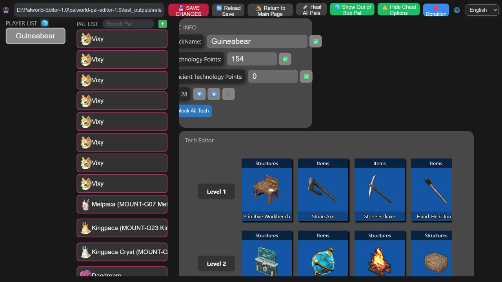
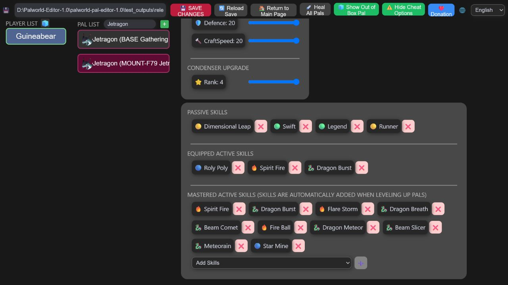

# Palworld Pal Editor — Palworld 1.0

A community-maintained Windows save editor updated and tested for **Palworld 1.0**. Edit players and Pals through a local browser interface—no files are uploaded anywhere.

[**Download the latest release**](https://github.com/Guineabear/Palworld-Pal-Editor/releases/latest) · [Version history](https://github.com/Guineabear/Palworld-Pal-Editor/releases)

> [!IMPORTANT]
> Stop Palworld or your dedicated server before editing. Keep a separate backup of the complete world folder. The editor also creates timestamped backups when it saves.

## Editor preview





## What works in Palworld 1.0

- Opens Steam local saves and Steam dedicated-server world folders.
- Reads the newer Oodle-compressed `PlM` saves and writes game-compatible `PlZ` saves.
- Supports Palworld 1.0 recovery-party timestamps stored as signed 64-bit map values.
- Supports the revised Palworld 1.0 guild-role and permission save layout.
- Edits Pal level, experience, rank, souls, IVs, work suitability, passives, active skills, and more.
- Supports up to six active passive skills. Palworld applies slots five and six but only displays the first four in its Pal details screen.
- Supports the Palworld 1.0 Awakening Crystal state.
- Includes reusable passive and active skill presets stored outside the program folder, so replacing the app does not erase them.
- Supports level 80, friendship level 10, soul enhancement level 20, and work suitability up to level 10.
- Includes refreshed 1.0 data: 704 Pal IDs, 433 human NPC IDs, 384 active skills, 420 passive skills, and the 1.0 experience curve.
- Edits player technology points, ancient technology points, unlocked recipes, and fast-travel points.
- Makes timestamped backups before writing changes.

## Safe and advanced editing

Normal mode hides experimental content and cleans up incompatible species-exclusive moves when a Pal species changes. **Advanced editing** is always visible in the top bar and exposes experimental Pals, human NPCs, secret passives, unusual stats, and cross-species moves.

Advanced combinations are written exactly as requested, but Palworld may sanitize unsupported data when it loads. For active skills: add or equip the move, choose **Save Changes** in the top bar, close the editor, and only then start Palworld.

Passive descriptions come from the extracted game data where available. When the source has no text, Paldeck shows a calculation from known stat fields or clearly says that no reliable description is available.

## Quick start

1. Open the [latest release](https://github.com/Guineabear/Palworld-Pal-Editor/releases/latest) and download the Windows `.exe`.
2. Fully stop Palworld or the dedicated server.
3. Run the editor. Windows SmartScreen may warn because this community build is unsigned; choose **More info → Run anyway** only if you downloaded it from this repository.
4. Select the world folder containing `Level.sav` and the `Players` folder, then choose **Load Save**.
5. Make your changes, choose **Save Changes**, close the editor, and restart the game or server.

Common Steam save locations:

```text
Local:     %LOCALAPPDATA%\Pal\Saved\SaveGames\<SteamID>\<WorldID>
Dedicated: ...\PalServer\Pal\Saved\SaveGames\0\<WorldID>
```

## Tested scope

This fork has been checked with:

- Current merchant variants loading on a dedicated server with working buy and sell interactions.
- The production web interface and packaged Windows executable.
- Real Palworld 1.0 saves using the full `PlM → PlZ → reload` round trip.
- A reported 93 MB decompressed dedicated-server save with signed 64-bit recovery timestamps, including a complete save-and-reopen round trip.
- A dedicated server successfully loading saves written by the editor.
- Six-passive testing on an ordinary Jetragon: `Immortality` produced the exact expected in-game Attack increase from both slot five and slot six while remaining hidden on the Pal details screen.
- Python compilation and the frontend production build.

## Current limitations

- Steam-format saves are supported. Xbox/Game Pass save conversion is not included.
- Direct editing of `GlobalPalStorage.sav` is not exposed in the interface.
- Combat-only, drone, reward, and quest NPCs plus unreleased Pals are marked **Experimental** and hidden unless cheat options are shown.
- Cross-species exclusive moves can be written in Advanced editing, but the game may remove them during load.
- This is an unofficial community tool. Back up your world before every editing session.

Found a problem? [Open an issue](https://github.com/Guineabear/Palworld-Pal-Editor/issues) and include the editor version, whether the save is local or dedicated, and the error message. Do not upload private save files publicly.

## Support

### Palworld 1.0 fork maintenance

If this updated fork helped you, you can support **Guineabear**:

- [Ko-fi](https://ko-fi.com/guineabear)
- [PayPal](https://paypal.me/guineabear)

### Original project development

This fork exists because of the original work by **_connlost / KrisCris**. Their original support links remain here:

- [Ko-fi](https://ko-fi.com/connlost)
- [PayPal](https://www.paypal.com/paypalme/c0nnlost?country.x=US&locale.x=en_US)

## Credits and license

- Based on the original [KrisCris/Palworld-Pal-Editor](https://github.com/KrisCris/Palworld-Pal-Editor).
- Save conversion is powered by [cheahjs/palworld-save-tools](https://github.com/cheahjs/palworld-save-tools).
- Community testing and data updates made the Palworld 1.0 release possible.

Licensed under [GPL-3.0](LICENSE). This project is not affiliated with Pocketpair.

Maintenance documentation: [Contributing](CONTRIBUTING.md) · [Architecture](docs/ARCHITECTURE.md) · [v0.16.0 notes](docs/releases/v0.16.0.md)
